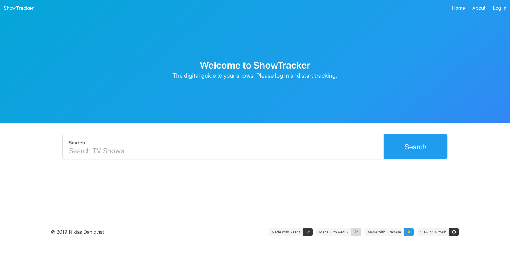
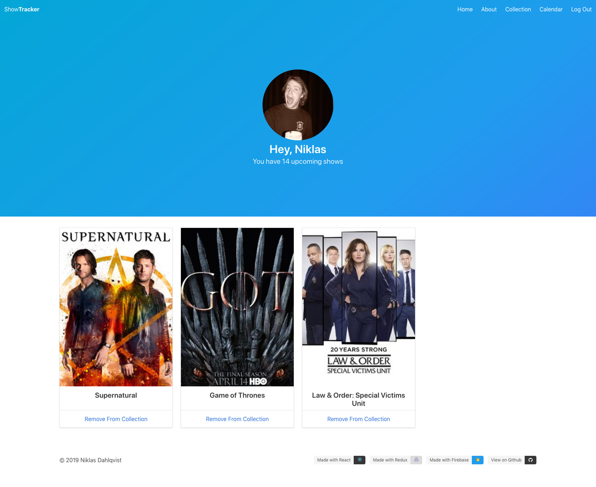
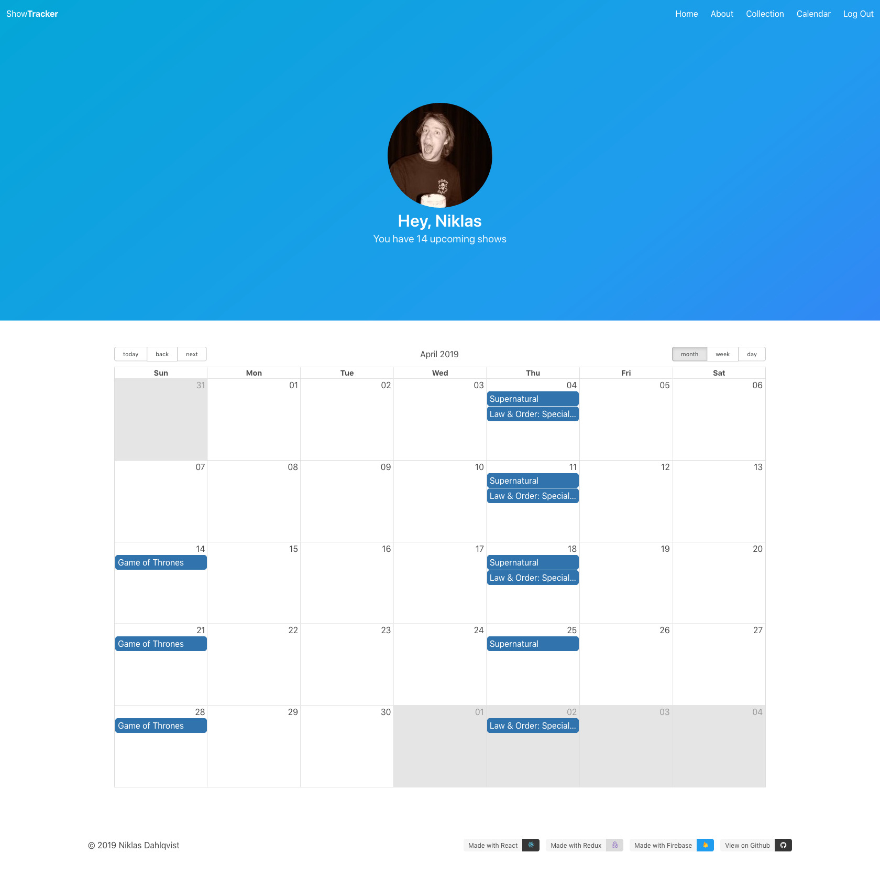

<figure class="figure figure--center">
  
  <figcaption class="figure__caption">
    First you need to find the TV shows you want to track.
  </figcaption>
</figure>

This project is a simple TV Show Tracker built with React, Redux, and Firebase. It keeps track of TV shows and when they air and puts in a calendar for you. It uses Google authentication and stores your collection in Firebase.

<figure class="figure figure--center">
  
  <figcaption class="figure__caption">
    Sample TV Show Collection
  </figcaption>
</figure>

You can add or remove shows that you are tracking.

<figure class="figure figure--center">
  
  <figcaption class="figure__caption">
    Hmm, I wonder why most of my shows air on Thursdays?
  </figcaption>
</figure>